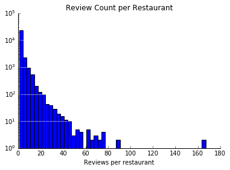

## Contents
{:.no_toc}
*  
{: toc}


```python
def get_desired_restaurants(df, category_list):
    desired_rows = []

    for row in df.iterrows():
        for cat in category_list:
            # get row if it is in the correct category
            if cat in row[1]['categories']:
                desired_rows.append(row[1])

    df_desired = pd.DataFrame(desired_rows)

    # drop duplicates from multiple categories
    df_desired = df_desired[df_desired['review_id'].duplicated() == False]
    return(df_desired)           
```


```python
def get_data_yearly(df, year):
    return df[df['date'].dt.strftime('%Y') == year]
```


```python
def remove_border(axes=None, top=False, right=False, left=True, bottom=True):
    """
    Minimize chartjunk by stripping out unnecesasry plot borders and axis ticks
    
    The top/right/left/bottom keywords toggle whether the corresponding plot border is drawn
    """
    ax = axes or plt.gca()
    ax.spines['top'].set_visible(top)
    ax.spines['right'].set_visible(right)
    ax.spines['left'].set_visible(left)
    ax.spines['bottom'].set_visible(bottom)
    
    #turn off all ticks
    ax.yaxis.set_ticks_position('none')
    ax.xaxis.set_ticks_position('none')
    
    #now re-enable visibles
    if top:
        ax.xaxis.tick_top()
    if bottom:
        ax.xaxis.tick_bottom()
    if left:
        ax.yaxis.tick_left()
    if right:
        ax.yaxis.tick_right()
        
pd.set_option('display.width', 500)
pd.set_option('display.max_columns', 100)
```


```python
df_biz = pd.read_json('/Users/alliwiggins/Documents/cs109a/dataset/business.json', lines = True)
df_check = pd.read_json('/Users/alliwiggins/Documents/cs109a/dataset/checkin.json', lines = True)

df_review_samp = pd.read_json('/Users/alliwiggins/Documents/cs109a/dataset/sample_review.json', lines = True)
df_usr_samp = pd.read_json('/Users/alliwiggins/Documents/cs109a/dataset/sample_user.json', lines = True)
```


```python
print("The total number of users read in is: ", df_usr_samp.shape[0])
print("The total number of reviews read in is: ", df_review_samp.shape[0])
```


    The total number of users read in is:  236535
    The total number of reviews read in is:  616040


```python
df_usr_subset = df_usr_samp[df_usr_samp['user_id'].isin(df_review_samp['user_id'])]

df_rvw_subset = df_review_samp[df_review_samp['user_id'].isin(df_usr_subset['user_id'])]


df_biz_subset = df_biz[df_biz['business_id'].isin(df_rvw_subset['business_id'])]
df_check_subset = df_check[df_check['business_id'].isin(df_biz_subset['business_id'])]
```


```python
print("The total number of unique recorded businesses in this sample is: ", len(df_rvw_subset['business_id'].unique()))
print("The total number of unique recorded users in this sample is: ", len(df_usr_subset['user_id'].unique()))
print("The total number of recorded reviews in this sample is: ", df_rvw_subset.shape[0])
```


    The total number of unique recorded businesses in this sample is:  50696
    The total number of unique recorded users in this sample is:  67101
    The total number of recorded reviews in this sample is:  123080


```python
df_rvw_usr = df_usr_subset.merge(df_rvw_subset, on = 'user_id', how = 'left')

df_rvw_usr_biz = df_rvw_usr.merge(df_biz_subset, on = 'business_id', how = 'left')

dict_checkins = {}

for index, row in df_check_subset.iterrows():
    for key in row['time'].keys(): 
        dict_checkins[row['business_id']] = np.sum(list(row['time'][key].values()))

checkin_series = pd.Series(dict_checkins, name = 'total_checkins')
df_check_merger = pd.DataFrame(checkin_series).reset_index()
df_check_merger.columns = ['business_id', 'total_checkins']

df_all = df_rvw_usr_biz.merge(df_check_merger, on = 'business_id', how = 'left')

df_all.fillna(0, inplace = True)

print(df_all.shape[0] == df_rvw_subset.shape[0])
```


    True


```python


df_all.drop(['name_x', 'name_y', 'latitude', 'longitude', 'neighborhood'], axis = 1, inplace = True)

df_all.columns = ['average_stars_usr', 'compliment_cool', 'compliment_cute',
       'compliment_funny', 'compliment_hot', 'compliment_list',
       'compliment_more', 'compliment_note', 'compliment_photos',
       'compliment_plain', 'compliment_profile', 'compliment_writer', 'cool_usr',
       'elite', 'fans', 'friends', 'funny_usr', 'review_count_usr', 'useful_usr',
       'user_id', 'yelping_since', 'business_id', 'cool_rvw', 'date', 'funny_rvw',
       'review_id', 'stars_rvw', 'text', 'useful_rvw', 'address', 'attributes',
       'categories', 'city', 'hours', 'is_open', 'postal_code',
       'review_count_biz', 'stars_biz', 'state', 'total_checkins']
```


```python
df_all.head()
```


<div>
<style>
    .dataframe thead tr:only-child th {
        text-align: right;
    }

    .dataframe thead th {
        text-align: left;
    }

    .dataframe tbody tr th {
        vertical-align: top;
    }
</style>
<table border="1" class="dataframe">
  <thead>
    <tr style="text-align: right;">
      <th></th>
      <th>average_stars_usr</th>
      <th>compliment_cool</th>
      <th>compliment_cute</th>
      <th>compliment_funny</th>
      <th>compliment_hot</th>
      <th>compliment_list</th>
      <th>compliment_more</th>
      <th>compliment_note</th>
      <th>compliment_photos</th>
      <th>compliment_plain</th>
      <th>compliment_profile</th>
      <th>compliment_writer</th>
      <th>cool_usr</th>
      <th>elite</th>
      <th>fans</th>
      <th>friends</th>
      <th>funny_usr</th>
      <th>review_count_usr</th>
      <th>useful_usr</th>
      <th>user_id</th>
      <th>yelping_since</th>
      <th>business_id</th>
      <th>cool_rvw</th>
      <th>date</th>
      <th>funny_rvw</th>
      <th>review_id</th>
      <th>stars_rvw</th>
      <th>text</th>
      <th>useful_rvw</th>
      <th>address</th>
      <th>attributes</th>
      <th>categories</th>
      <th>city</th>
      <th>hours</th>
      <th>is_open</th>
      <th>postal_code</th>
      <th>review_count_biz</th>
      <th>stars_biz</th>
      <th>state</th>
      <th>total_checkins</th>
    </tr>
  </thead>
  <tbody>
    <tr>
      <th>0</th>
      <td>3.91</td>
      <td>7</td>
      <td>0</td>
      <td>7</td>
      <td>1</td>
      <td>0</td>
      <td>1</td>
      <td>8</td>
      <td>2</td>
      <td>17</td>
      <td>0</td>
      <td>5</td>
      <td>45</td>
      <td>[2016, 2017, 2015]</td>
      <td>6</td>
      <td>[ZRHPR_mj9A1p6guJ4myTow, DDF6lbrU8TJRS4BtsKkdA...</td>
      <td>21</td>
      <td>375</td>
      <td>41</td>
      <td>gGdg9LOh61iUX1ui6suS0w</td>
      <td>2013-11-25</td>
      <td>z71CwRHhAuiHoSnUz7IIRQ</td>
      <td>0</td>
      <td>2016-06-08</td>
      <td>0</td>
      <td>P5FSUlIx7EY2fOF21llRnw</td>
      <td>4</td>
      <td>wirklich großes baufachgeschäft. hier endlich ...</td>
      <td>0</td>
      <td>Augsburger Str. 500</td>
      <td>{}</td>
      <td>[Hardware Stores, Home Services, Building Supp...</td>
      <td>Stuttgart</td>
      <td>{'Monday': '8:00-20:00', 'Tuesday': '8:00-20:0...</td>
      <td>1</td>
      <td>70327</td>
      <td>3</td>
      <td>4.0</td>
      <td>BW</td>
      <td>2.0</td>
    </tr>
    <tr>
      <th>1</th>
      <td>3.91</td>
      <td>7</td>
      <td>0</td>
      <td>7</td>
      <td>1</td>
      <td>0</td>
      <td>1</td>
      <td>8</td>
      <td>2</td>
      <td>17</td>
      <td>0</td>
      <td>5</td>
      <td>45</td>
      <td>[2016, 2017, 2015]</td>
      <td>6</td>
      <td>[ZRHPR_mj9A1p6guJ4myTow, DDF6lbrU8TJRS4BtsKkdA...</td>
      <td>21</td>
      <td>375</td>
      <td>41</td>
      <td>gGdg9LOh61iUX1ui6suS0w</td>
      <td>2013-11-25</td>
      <td>3h4ECb0-RTL9_OeYHafMwA</td>
      <td>0</td>
      <td>2014-03-14</td>
      <td>0</td>
      <td>F_OtJbA1Ka1zb71CqUWt_g</td>
      <td>5</td>
      <td>auch von mir 5 sterne. ja, hier ist wirklich a...</td>
      <td>0</td>
      <td>Daimlerstr. 104</td>
      <td>{'GoodForMeal': {'dessert': False, 'latenight'...</td>
      <td>[Food, Fast Food, Restaurants]</td>
      <td>Stuttgart</td>
      <td>{'Monday': '9:00-18:00', 'Tuesday': '9:00-18:0...</td>
      <td>1</td>
      <td>70372</td>
      <td>6</td>
      <td>5.0</td>
      <td>BW</td>
      <td>0.0</td>
    </tr>
    <tr>
      <th>2</th>
      <td>3.91</td>
      <td>7</td>
      <td>0</td>
      <td>7</td>
      <td>1</td>
      <td>0</td>
      <td>1</td>
      <td>8</td>
      <td>2</td>
      <td>17</td>
      <td>0</td>
      <td>5</td>
      <td>45</td>
      <td>[2016, 2017, 2015]</td>
      <td>6</td>
      <td>[ZRHPR_mj9A1p6guJ4myTow, DDF6lbrU8TJRS4BtsKkdA...</td>
      <td>21</td>
      <td>375</td>
      <td>41</td>
      <td>gGdg9LOh61iUX1ui6suS0w</td>
      <td>2013-11-25</td>
      <td>xVmR_J2FjrGNOrWn_y2QKg</td>
      <td>1</td>
      <td>2015-04-17</td>
      <td>0</td>
      <td>ZWjCil702YKFzQEZSY-_TA</td>
      <td>3</td>
      <td>eigentlich mag ich solche großen brauhäuser mi...</td>
      <td>1</td>
      <td>Bolzstr. 10</td>
      <td>{'RestaurantsTableService': True, 'GoodForMeal...</td>
      <td>[Breweries, Restaurants, Beer Hall, Gastropubs...</td>
      <td>Stuttgart</td>
      <td>{'Monday': '11:00-0:00', 'Tuesday': '11:00-0:0...</td>
      <td>1</td>
      <td>70173</td>
      <td>79</td>
      <td>3.5</td>
      <td>BW</td>
      <td>12.0</td>
    </tr>
    <tr>
      <th>3</th>
      <td>3.91</td>
      <td>7</td>
      <td>0</td>
      <td>7</td>
      <td>1</td>
      <td>0</td>
      <td>1</td>
      <td>8</td>
      <td>2</td>
      <td>17</td>
      <td>0</td>
      <td>5</td>
      <td>45</td>
      <td>[2016, 2017, 2015]</td>
      <td>6</td>
      <td>[ZRHPR_mj9A1p6guJ4myTow, DDF6lbrU8TJRS4BtsKkdA...</td>
      <td>21</td>
      <td>375</td>
      <td>41</td>
      <td>gGdg9LOh61iUX1ui6suS0w</td>
      <td>2013-11-25</td>
      <td>XVk7W6EuiLVSjpIg2npvUw</td>
      <td>0</td>
      <td>2016-12-23</td>
      <td>0</td>
      <td>NMATy5SPYoW7f5h1DOMFKg</td>
      <td>3</td>
      <td>naja. man wird satt. aber viel mehr darf man n...</td>
      <td>0</td>
      <td>Felgergasse 7</td>
      <td>{'NoiseLevel': 'loud'}</td>
      <td>[Restaurants, Food, German, Breweries]</td>
      <td>Stuttgart</td>
      <td>{'Monday': '11:30-23:00', 'Tuesday': '11:30-23...</td>
      <td>1</td>
      <td>70372</td>
      <td>6</td>
      <td>4.0</td>
      <td>BW</td>
      <td>2.0</td>
    </tr>
    <tr>
      <th>4</th>
      <td>3.91</td>
      <td>7</td>
      <td>0</td>
      <td>7</td>
      <td>1</td>
      <td>0</td>
      <td>1</td>
      <td>8</td>
      <td>2</td>
      <td>17</td>
      <td>0</td>
      <td>5</td>
      <td>45</td>
      <td>[2016, 2017, 2015]</td>
      <td>6</td>
      <td>[ZRHPR_mj9A1p6guJ4myTow, DDF6lbrU8TJRS4BtsKkdA...</td>
      <td>21</td>
      <td>375</td>
      <td>41</td>
      <td>gGdg9LOh61iUX1ui6suS0w</td>
      <td>2013-11-25</td>
      <td>DVxOGucZ3NpIeTtbk1ZpAg</td>
      <td>0</td>
      <td>2014-01-12</td>
      <td>0</td>
      <td>MtPSN7mL5wnliC-CAwYzOA</td>
      <td>3</td>
      <td>leider immer mehr leerstände. strauss hat nun ...</td>
      <td>0</td>
      <td>Wildunger Str. 2 - 4</td>
      <td>{'RestaurantsPriceRange2': 2, 'BusinessParking...</td>
      <td>[Bistros, Shopping, Shopping Centers, Fast Foo...</td>
      <td>Stuttgart</td>
      <td>{'Monday': '9:30-20:00', 'Tuesday': '9:30-20:0...</td>
      <td>1</td>
      <td>70372</td>
      <td>15</td>
      <td>3.5</td>
      <td>BW</td>
      <td>14.0</td>
    </tr>
  </tbody>
</table>
</div>


```python
df_rest_all = get_desired_restaurants(df_all, ['Food', 'Restaurants'])

```


```python
urc=df_rest_all.groupby('user_id').review_id.count()
ax=urc.hist(bins=50, log=True)
remove_border(ax)
plt.xlabel("Reviews per user")
plt.grid(False)
plt.grid(axis = 'y', color ='white', linestyle='-')
plt.title("Review Count per User");
plt.figure()

brc=df_rest_all.groupby('business_id').review_id.count()
ax=brc.hist(bins=50, log=True)
remove_border(ax)
plt.xlabel("Reviews per restaurant")
plt.grid(False)
plt.grid(axis = 'y', color ='white', linestyle='-')
plt.title("Review Count per Restaurant");
plt.figure()
```


    <matplotlib.figure.Figure at 0x12d835908>





    <matplotlib.figure.Figure at 0x12d835908>


Because many users did not have a lot of reviews, we decided to take a subset of the data in which we only looked at users who had given at least 10 reviews so that the user would exist in the train, test, and validation set.


```python
usr_rvw_appearances = df_rest_all['user_id'].value_counts()
df_rest= df_rest_all[df_rest_all['user_id'].isin(usr_rvw_appearances[usr_rvw_appearances>=10].index)]
```


```python
urc=df_rest.groupby('user_id').review_id.count()
ax=urc.hist(bins=50, log=True)
remove_border(ax)
plt.xlabel("Reviews per user")
plt.grid(False)
plt.grid(axis = 'y', color ='white', linestyle='-')
plt.title("Review Count per User");
plt.figure()

brc=df_rest.groupby('business_id').review_id.count()
ax=brc.hist(bins=50, log=True)
remove_border(ax)
plt.xlabel("Reviews per restaurant")
plt.grid(False)
plt.grid(axis = 'y', color ='white', linestyle='-')
plt.title("Review Count per Restaurant");
plt.figure()
```


    <matplotlib.figure.Figure at 0x165f54978>


    <matplotlib.figure.Figure at 0x165f54978>


After doing this, the distribution of the users and restaurants has fewer outliers although it is still skewed to the right.

We also noticed that a lot of restaurant who had a small amount of reviews. Thus, later on in our analysis we had to restrict the restaurants we looked at in the test and validation set according to whether or not the restaurant was present in the train set. 


```python
print(np.mean(df_rest_all['stars_rvw']))
stars=df_rest_all.stars_rvw
ax=stars.hist(bins=5)
remove_border(ax)
plt.xlabel("Star rating")
plt.grid(False)
plt.grid(axis = 'y', color ='white', linestyle='-')
plt.title("Star ratings over all reviews");
```


    3.7242261570282515


```python
plt.figure()
avg_ratings_by_user=df_rest.groupby('user_id').stars_rvw.mean()
ax=avg_ratings_by_user.hist()
remove_border(ax)
plt.xlabel("Average review score")
plt.grid(False)
plt.grid(axis = 'y', color ='white', linestyle='-')
plt.title("Average User Rating")
plt.figure()

avg_ratings_by_biz=df_rest.groupby('business_id').stars_rvw.mean()
ax=avg_ratings_by_biz.hist()
remove_border(ax)
plt.xlabel("Average review score")
plt.grid(False)
plt.grid(axis = 'y', color ='white', linestyle='-')
plt.title("Average Restaurant Rating")
plt.figure()

print(df_rest.stars_rvw.mean())
plt.figure()
```


    3.654464695971818


    <matplotlib.figure.Figure at 0x12a02d1d0>


    <matplotlib.figure.Figure at 0x129b316d8>


    <matplotlib.figure.Figure at 0x12a02d1d0>


```python

```

