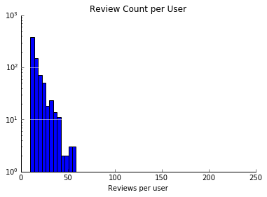
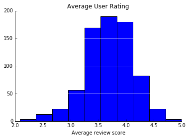

# EDA


## Data Description

The data was taken from the Yelp Dataset Challenge in which Yelp aimed to offer students the chance to explore and analyze their data. From this data, we were given 5 json files which contained information about yelp users and their reviews for different business. We are only looking at the restaurants within those business and the users that rated them.

The data was separated into five different JSON files from yelp (business.json, review.json, user.json, checkin.json, and tip.json.)  The review and user files are extremely large, so we decided to only read-in random samples of entries from each dataset stored in lists: sample_rvw and sample_usr. After doing this, we read in 237142 distinct users with 615653 distinct reviews.

We did not find any abnormalities in the data types for each variable, and we did not find any null values. The data was fairly clean.

**Business.json** holds dictionaries that describe location data, attributes and categories for each business. Such attributes include the business rating, takeout offerings, parking accommodations, and hours of operation. Initially, the dataset holds information about businesses outside of the restaurant industry, so we filtered it down to include only data for restaurants.

**Review.json** includes dictionaries for each review given by a user for a certain business. The dictionary includes text data for the actual review and a rating out of 5 stars. It also includes information about the business and votes given by other users on the usefulness, funniness, or “coolness” of the review.

**User.json** includes dictionaries about each user’s profile.  Profile data includes how many compliments a user may have received and the type of compliments received for their reviews. It also includes their name, information about their yelp membership and an array of their friends.

**Checkin.json** includes a dictionary for each time a user “checked in” or stated they were present at a business. Thus, there are vast amounts of entries.

**Tips.json** includes dictionaries for each tip a user gives. A tip is a shorter type of review that includes the user id, business id, the tip text, and likes from different users for that tip.

## Data Exploration


Because the data was so large, we reconciled by taking random samples of the review and users data so that it wazs more manageable. To unify the data from the separate JSON files, a random sample of reviews and users are read in and matched together on a unique user ID.  Then, these observations are matched to business data on a unique business ID.  Finally, these are matched with the variable containing total amount of check-ins on the business being reviewed.  The data is then pared down to contain only restaurants.  These steps leave us with a resulting dataframe in which each row represents a unique restaurant review and has numerous column variables with user, review, and business data describing the observation.  

For now, we decided to exclude tips.json from our EDA and analysis because we believe the data found in tips will offer no new information that cannot be found already in user reviews. Tips are quick suggestions or comments on restaurants that users can give in the form of likes and shorts texts.


```python
df_biz = pd.read_json('/Users/alliwiggins/Documents/cs109a/dataset/business.json', lines = True)
df_check = pd.read_json('/Users/alliwiggins/Documents/cs109a/dataset/checkin.json', lines = True)

df_review_samp = pd.read_json('/Users/alliwiggins/Documents/cs109a/dataset/sample_review.json', lines = True)
df_usr_samp = pd.read_json('/Users/alliwiggins/Documents/cs109a/dataset/sample_user.json', lines = True)

```


```python
df_biz.head()
```


<div>
<style>
    .dataframe thead tr:only-child th {
        text-align: right;
    }

    .dataframe thead th {
        text-align: left;
    }

    .dataframe tbody tr th {
        vertical-align: top;
    }
</style>
<table border="1" class="dataframe">
  <thead>
    <tr style="text-align: right;">
      <th></th>
      <th>address</th>
      <th>attributes</th>
      <th>business_id</th>
      <th>categories</th>
      <th>city</th>
      <th>hours</th>
      <th>is_open</th>
      <th>latitude</th>
      <th>longitude</th>
      <th>name</th>
      <th>neighborhood</th>
      <th>postal_code</th>
      <th>review_count</th>
      <th>stars</th>
      <th>state</th>
    </tr>
  </thead>
  <tbody>
    <tr>
      <th>0</th>
      <td>691 Richmond Rd</td>
      <td>{'RestaurantsPriceRange2': 2, 'BusinessParking...</td>
      <td>YDf95gJZaq05wvo7hTQbbQ</td>
      <td>[Shopping, Shopping Centers]</td>
      <td>Richmond Heights</td>
      <td>{'Monday': '10:00-21:00', 'Tuesday': '10:00-21...</td>
      <td>1</td>
      <td>41.541716</td>
      <td>-81.493116</td>
      <td>Richmond Town Square</td>
      <td></td>
      <td>44143</td>
      <td>17</td>
      <td>2.0</td>
      <td>OH</td>
    </tr>
    <tr>
      <th>1</th>
      <td>2824 Milton Rd</td>
      <td>{'GoodForMeal': {'dessert': False, 'latenight'...</td>
      <td>mLwM-h2YhXl2NCgdS84_Bw</td>
      <td>[Food, Soul Food, Convenience Stores, Restaura...</td>
      <td>Charlotte</td>
      <td>{'Monday': '10:00-22:00', 'Tuesday': '10:00-22...</td>
      <td>0</td>
      <td>35.236870</td>
      <td>-80.741976</td>
      <td>South Florida Style Chicken &amp; Ribs</td>
      <td>Eastland</td>
      <td>28215</td>
      <td>4</td>
      <td>4.5</td>
      <td>NC</td>
    </tr>
    <tr>
      <th>2</th>
      <td>337 Danforth Avenue</td>
      <td>{'BusinessParking': {'garage': False, 'street'...</td>
      <td>v2WhjAB3PIBA8J8VxG3wEg</td>
      <td>[Food, Coffee &amp; Tea]</td>
      <td>Toronto</td>
      <td>{'Monday': '10:00-19:00', 'Tuesday': '10:00-19...</td>
      <td>0</td>
      <td>43.677126</td>
      <td>-79.353285</td>
      <td>The Tea Emporium</td>
      <td>Riverdale</td>
      <td>M4K 1N7</td>
      <td>7</td>
      <td>4.5</td>
      <td>ON</td>
    </tr>
    <tr>
      <th>3</th>
      <td>7702 E Doubletree Ranch Rd, Ste 300</td>
      <td>{}</td>
      <td>CVtCbSB1zUcUWg-9TNGTuQ</td>
      <td>[Professional Services, Matchmakers]</td>
      <td>Scottsdale</td>
      <td>{'Friday': '9:00-17:00', 'Tuesday': '9:00-17:0...</td>
      <td>1</td>
      <td>33.565082</td>
      <td>-111.916400</td>
      <td>TRUmatch</td>
      <td></td>
      <td>85258</td>
      <td>3</td>
      <td>3.0</td>
      <td>AZ</td>
    </tr>
    <tr>
      <th>4</th>
      <td>4719 N 20Th St</td>
      <td>{'RestaurantsTableService': False, 'GoodForMea...</td>
      <td>duHFBe87uNSXImQmvBh87Q</td>
      <td>[Sandwiches, Restaurants]</td>
      <td>Phoenix</td>
      <td>{}</td>
      <td>0</td>
      <td>33.505928</td>
      <td>-112.038847</td>
      <td>Blimpie</td>
      <td></td>
      <td>85016</td>
      <td>10</td>
      <td>4.5</td>
      <td>AZ</td>
    </tr>
  </tbody>
</table>
</div>


```python
df_check.head()
```


<div>
<style>
    .dataframe thead tr:only-child th {
        text-align: right;
    }

    .dataframe thead th {
        text-align: left;
    }

    .dataframe tbody tr th {
        vertical-align: top;
    }
</style>
<table border="1" class="dataframe">
  <thead>
    <tr style="text-align: right;">
      <th></th>
      <th>business_id</th>
      <th>time</th>
    </tr>
  </thead>
  <tbody>
    <tr>
      <th>0</th>
      <td>7KPBkxAOEtb3QeIL9PEErg</td>
      <td>{'Thursday': {'21:00': 4, '1:00': 1, '4:00': 1...</td>
    </tr>
    <tr>
      <th>1</th>
      <td>kREVIrSBbtqBhIYkTccQUg</td>
      <td>{'Monday': {'13:00': 1}, 'Thursday': {'20:00':...</td>
    </tr>
    <tr>
      <th>2</th>
      <td>tJRDll5yqpZwehenzE2cSg</td>
      <td>{'Monday': {'12:00': 1, '1:00': 1}, 'Saturday'...</td>
    </tr>
    <tr>
      <th>3</th>
      <td>nhZ1HGWD8lMErdn3FuWuTQ</td>
      <td>{'Sunday': {'18:00': 1, '17:00': 2, '22:00': 1...</td>
    </tr>
    <tr>
      <th>4</th>
      <td>vDoXZGE7p6xAkKQ0XQPvoA</td>
      <td>{'Thursday': {'15:00': 1}, 'Saturday': {'23:00...</td>
    </tr>
  </tbody>
</table>
</div>


```python
df_review_samp.head()
```


<div>
<style>
    .dataframe thead tr:only-child th {
        text-align: right;
    }

    .dataframe thead th {
        text-align: left;
    }

    .dataframe tbody tr th {
        vertical-align: top;
    }
</style>
<table border="1" class="dataframe">
  <thead>
    <tr style="text-align: right;">
      <th></th>
      <th>business_id</th>
      <th>cool</th>
      <th>date</th>
      <th>funny</th>
      <th>review_id</th>
      <th>stars</th>
      <th>text</th>
      <th>useful</th>
      <th>user_id</th>
    </tr>
  </thead>
  <tbody>
    <tr>
      <th>0</th>
      <td>uYHaNptLzDLoV_JZ_MuzUA</td>
      <td>0</td>
      <td>2015-07-27</td>
      <td>0</td>
      <td>6JF4WfHgwYrrdZ2VeYtnFw</td>
      <td>3</td>
      <td>Stayed here for two nights, costs was £109 per...</td>
      <td>1</td>
      <td>Q-3YCVywc03w56wYtGlKvg</td>
    </tr>
    <tr>
      <th>1</th>
      <td>jQsNFOzDpxPmOurSWCg1vQ</td>
      <td>0</td>
      <td>2011-08-10</td>
      <td>0</td>
      <td>GiEB_A-m9HuX521WQNbL8w</td>
      <td>4</td>
      <td>1st! Place is not closed. There was an issue w...</td>
      <td>1</td>
      <td>UG4EKu13JRwzRix6ESINdg</td>
    </tr>
    <tr>
      <th>2</th>
      <td>jQsNFOzDpxPmOurSWCg1vQ</td>
      <td>0</td>
      <td>2012-10-08</td>
      <td>0</td>
      <td>ai6O4UqqDqnjO7gfz6jBkA</td>
      <td>3</td>
      <td>1st visit had the lo mein...delish!  \n2nd vis...</td>
      <td>0</td>
      <td>R6vb0FtmClhfwajs_AuusQ</td>
    </tr>
    <tr>
      <th>3</th>
      <td>jQsNFOzDpxPmOurSWCg1vQ</td>
      <td>6</td>
      <td>2015-02-12</td>
      <td>5</td>
      <td>sb7iYaCc6ggpShtElkcwiw</td>
      <td>3</td>
      <td>My wife wanted to try this place for awhile no...</td>
      <td>7</td>
      <td>6jz_Yr6_AP2WWLbj9gGDpA</td>
    </tr>
    <tr>
      <th>4</th>
      <td>jQsNFOzDpxPmOurSWCg1vQ</td>
      <td>0</td>
      <td>2009-01-24</td>
      <td>0</td>
      <td>j51qEbi4hMm6WHGlkt57xg</td>
      <td>2</td>
      <td>Haven't eaten at this location in particular, ...</td>
      <td>1</td>
      <td>UXZDRVdx8eJqdqb13Bcfcg</td>
    </tr>
  </tbody>
</table>
</div>


```python
df_usr_samp.head()
```


<div>
<style>
    .dataframe thead tr:only-child th {
        text-align: right;
    }

    .dataframe thead th {
        text-align: left;
    }

    .dataframe tbody tr th {
        vertical-align: top;
    }
</style>
<table border="1" class="dataframe">
  <thead>
    <tr style="text-align: right;">
      <th></th>
      <th>average_stars</th>
      <th>compliment_cool</th>
      <th>compliment_cute</th>
      <th>compliment_funny</th>
      <th>compliment_hot</th>
      <th>compliment_list</th>
      <th>compliment_more</th>
      <th>compliment_note</th>
      <th>compliment_photos</th>
      <th>compliment_plain</th>
      <th>compliment_profile</th>
      <th>compliment_writer</th>
      <th>cool</th>
      <th>elite</th>
      <th>fans</th>
      <th>friends</th>
      <th>funny</th>
      <th>name</th>
      <th>review_count</th>
      <th>useful</th>
      <th>user_id</th>
      <th>yelping_since</th>
    </tr>
  </thead>
  <tbody>
    <tr>
      <th>0</th>
      <td>4.06</td>
      <td>4</td>
      <td>0</td>
      <td>4</td>
      <td>5</td>
      <td>0</td>
      <td>5</td>
      <td>4</td>
      <td>5</td>
      <td>5</td>
      <td>1</td>
      <td>22</td>
      <td>1</td>
      <td>[2016, 2015]</td>
      <td>5</td>
      <td>[Puvuej6lzJ1JOEmtjG7V_Q, fq7CL1myWPYeH0d4bKtsI...</td>
      <td>3</td>
      <td>Erica</td>
      <td>68</td>
      <td>5</td>
      <td>YHJIMK_zVH_VY6HCY6bYvg</td>
      <td>2012-06-08</td>
    </tr>
    <tr>
      <th>1</th>
      <td>3.91</td>
      <td>7</td>
      <td>0</td>
      <td>7</td>
      <td>1</td>
      <td>0</td>
      <td>1</td>
      <td>8</td>
      <td>2</td>
      <td>17</td>
      <td>0</td>
      <td>5</td>
      <td>45</td>
      <td>[2016, 2017, 2015]</td>
      <td>6</td>
      <td>[ZRHPR_mj9A1p6guJ4myTow, DDF6lbrU8TJRS4BtsKkdA...</td>
      <td>21</td>
      <td>Andreas</td>
      <td>375</td>
      <td>41</td>
      <td>gGdg9LOh61iUX1ui6suS0w</td>
      <td>2013-11-25</td>
    </tr>
    <tr>
      <th>2</th>
      <td>4.07</td>
      <td>4</td>
      <td>0</td>
      <td>4</td>
      <td>3</td>
      <td>0</td>
      <td>1</td>
      <td>1</td>
      <td>0</td>
      <td>1</td>
      <td>0</td>
      <td>1</td>
      <td>14</td>
      <td>[]</td>
      <td>4</td>
      <td>[ZAkeWdyAQy37YYb59NCgcg, Cxu5vpkpUWIv0-oEH4lV7...</td>
      <td>3</td>
      <td>Ember</td>
      <td>24</td>
      <td>41</td>
      <td>NUEQYD6T-ixWejImJYlDHQ</td>
      <td>2013-01-20</td>
    </tr>
    <tr>
      <th>3</th>
      <td>4.27</td>
      <td>3</td>
      <td>0</td>
      <td>3</td>
      <td>0</td>
      <td>0</td>
      <td>1</td>
      <td>6</td>
      <td>2</td>
      <td>5</td>
      <td>0</td>
      <td>2</td>
      <td>75</td>
      <td>[2016, 2017, 2015, 2014]</td>
      <td>13</td>
      <td>[Z_0TuoNCeE1xVGZ3peYzwQ, aSCTF9U9nE1yFfQM85mWO...</td>
      <td>80</td>
      <td>Robert</td>
      <td>233</td>
      <td>343</td>
      <td>r5aSkafqboBd4L6v8_1Pow</td>
      <td>2012-02-02</td>
    </tr>
    <tr>
      <th>4</th>
      <td>4.15</td>
      <td>6</td>
      <td>0</td>
      <td>6</td>
      <td>2</td>
      <td>0</td>
      <td>0</td>
      <td>5</td>
      <td>1</td>
      <td>4</td>
      <td>0</td>
      <td>2</td>
      <td>7</td>
      <td>[]</td>
      <td>2</td>
      <td>[tgPjX5MplSOXubcTqvCNtw, 6wRnnHSKO05sJ8SALkY8w...</td>
      <td>3</td>
      <td>Colleen</td>
      <td>32</td>
      <td>19</td>
      <td>s8bVHRqx6cI8F8HGf3A_og</td>
      <td>2014-12-18</td>
    </tr>
  </tbody>
</table>
</div>


```python
print("The total number of users read in is: ", df_usr_samp.shape[0])
print("The total number of reviews read in is: ", df_review_samp.shape[0])
```


    The total number of users read in is:  236535
    The total number of reviews read in is:  616040


```python
# 64301 unique businesses out of 1880087 total reviews (average 3 reviews for every restaurant)
print("The total number of unique recorded businesses in this sample is: ", len(df_rvw_subset['business_id'].unique()))
print("The total number of unique recorded users in this sample is: ", len(df_usr_subset['user_id'].unique()))
print("The total number of recorded reviews in this sample is: ", df_rvw_subset.shape[0])
```


    The total number of unique recorded businesses in this sample is:  50696
    The total number of unique recorded users in this sample is:  67101
    The total number of recorded reviews in this sample is:  123080


```python
# explain pairing of final dataset
```


    True


```python
df_all.head()
```


<div>
<style>
    .dataframe thead tr:only-child th {
        text-align: right;
    }

    .dataframe thead th {
        text-align: left;
    }

    .dataframe tbody tr th {
        vertical-align: top;
    }
</style>
<table border="1" class="dataframe">
  <thead>
    <tr style="text-align: right;">
      <th></th>
      <th>average_stars_usr</th>
      <th>compliment_cool</th>
      <th>compliment_cute</th>
      <th>compliment_funny</th>
      <th>compliment_hot</th>
      <th>compliment_list</th>
      <th>compliment_more</th>
      <th>compliment_note</th>
      <th>compliment_photos</th>
      <th>compliment_plain</th>
      <th>compliment_profile</th>
      <th>compliment_writer</th>
      <th>cool_usr</th>
      <th>elite</th>
      <th>fans</th>
      <th>friends</th>
      <th>funny_usr</th>
      <th>review_count_usr</th>
      <th>useful_usr</th>
      <th>user_id</th>
      <th>yelping_since</th>
      <th>business_id</th>
      <th>cool_rvw</th>
      <th>date</th>
      <th>funny_rvw</th>
      <th>review_id</th>
      <th>stars_rvw</th>
      <th>text</th>
      <th>useful_rvw</th>
      <th>address</th>
      <th>attributes</th>
      <th>categories</th>
      <th>city</th>
      <th>hours</th>
      <th>is_open</th>
      <th>postal_code</th>
      <th>review_count_biz</th>
      <th>stars_biz</th>
      <th>state</th>
      <th>total_checkins</th>
    </tr>
  </thead>
  <tbody>
    <tr>
      <th>0</th>
      <td>3.91</td>
      <td>7</td>
      <td>0</td>
      <td>7</td>
      <td>1</td>
      <td>0</td>
      <td>1</td>
      <td>8</td>
      <td>2</td>
      <td>17</td>
      <td>0</td>
      <td>5</td>
      <td>45</td>
      <td>[2016, 2017, 2015]</td>
      <td>6</td>
      <td>[ZRHPR_mj9A1p6guJ4myTow, DDF6lbrU8TJRS4BtsKkdA...</td>
      <td>21</td>
      <td>375</td>
      <td>41</td>
      <td>gGdg9LOh61iUX1ui6suS0w</td>
      <td>2013-11-25</td>
      <td>z71CwRHhAuiHoSnUz7IIRQ</td>
      <td>0</td>
      <td>2016-06-08</td>
      <td>0</td>
      <td>P5FSUlIx7EY2fOF21llRnw</td>
      <td>4</td>
      <td>wirklich großes baufachgeschäft. hier endlich ...</td>
      <td>0</td>
      <td>Augsburger Str. 500</td>
      <td>{}</td>
      <td>[Hardware Stores, Home Services, Building Supp...</td>
      <td>Stuttgart</td>
      <td>{'Monday': '8:00-20:00', 'Tuesday': '8:00-20:0...</td>
      <td>1</td>
      <td>70327</td>
      <td>3</td>
      <td>4.0</td>
      <td>BW</td>
      <td>2.0</td>
    </tr>
    <tr>
      <th>1</th>
      <td>3.91</td>
      <td>7</td>
      <td>0</td>
      <td>7</td>
      <td>1</td>
      <td>0</td>
      <td>1</td>
      <td>8</td>
      <td>2</td>
      <td>17</td>
      <td>0</td>
      <td>5</td>
      <td>45</td>
      <td>[2016, 2017, 2015]</td>
      <td>6</td>
      <td>[ZRHPR_mj9A1p6guJ4myTow, DDF6lbrU8TJRS4BtsKkdA...</td>
      <td>21</td>
      <td>375</td>
      <td>41</td>
      <td>gGdg9LOh61iUX1ui6suS0w</td>
      <td>2013-11-25</td>
      <td>3h4ECb0-RTL9_OeYHafMwA</td>
      <td>0</td>
      <td>2014-03-14</td>
      <td>0</td>
      <td>F_OtJbA1Ka1zb71CqUWt_g</td>
      <td>5</td>
      <td>auch von mir 5 sterne. ja, hier ist wirklich a...</td>
      <td>0</td>
      <td>Daimlerstr. 104</td>
      <td>{'GoodForMeal': {'dessert': False, 'latenight'...</td>
      <td>[Food, Fast Food, Restaurants]</td>
      <td>Stuttgart</td>
      <td>{'Monday': '9:00-18:00', 'Tuesday': '9:00-18:0...</td>
      <td>1</td>
      <td>70372</td>
      <td>6</td>
      <td>5.0</td>
      <td>BW</td>
      <td>0.0</td>
    </tr>
    <tr>
      <th>2</th>
      <td>3.91</td>
      <td>7</td>
      <td>0</td>
      <td>7</td>
      <td>1</td>
      <td>0</td>
      <td>1</td>
      <td>8</td>
      <td>2</td>
      <td>17</td>
      <td>0</td>
      <td>5</td>
      <td>45</td>
      <td>[2016, 2017, 2015]</td>
      <td>6</td>
      <td>[ZRHPR_mj9A1p6guJ4myTow, DDF6lbrU8TJRS4BtsKkdA...</td>
      <td>21</td>
      <td>375</td>
      <td>41</td>
      <td>gGdg9LOh61iUX1ui6suS0w</td>
      <td>2013-11-25</td>
      <td>xVmR_J2FjrGNOrWn_y2QKg</td>
      <td>1</td>
      <td>2015-04-17</td>
      <td>0</td>
      <td>ZWjCil702YKFzQEZSY-_TA</td>
      <td>3</td>
      <td>eigentlich mag ich solche großen brauhäuser mi...</td>
      <td>1</td>
      <td>Bolzstr. 10</td>
      <td>{'RestaurantsTableService': True, 'GoodForMeal...</td>
      <td>[Breweries, Restaurants, Beer Hall, Gastropubs...</td>
      <td>Stuttgart</td>
      <td>{'Monday': '11:00-0:00', 'Tuesday': '11:00-0:0...</td>
      <td>1</td>
      <td>70173</td>
      <td>79</td>
      <td>3.5</td>
      <td>BW</td>
      <td>12.0</td>
    </tr>
    <tr>
      <th>3</th>
      <td>3.91</td>
      <td>7</td>
      <td>0</td>
      <td>7</td>
      <td>1</td>
      <td>0</td>
      <td>1</td>
      <td>8</td>
      <td>2</td>
      <td>17</td>
      <td>0</td>
      <td>5</td>
      <td>45</td>
      <td>[2016, 2017, 2015]</td>
      <td>6</td>
      <td>[ZRHPR_mj9A1p6guJ4myTow, DDF6lbrU8TJRS4BtsKkdA...</td>
      <td>21</td>
      <td>375</td>
      <td>41</td>
      <td>gGdg9LOh61iUX1ui6suS0w</td>
      <td>2013-11-25</td>
      <td>XVk7W6EuiLVSjpIg2npvUw</td>
      <td>0</td>
      <td>2016-12-23</td>
      <td>0</td>
      <td>NMATy5SPYoW7f5h1DOMFKg</td>
      <td>3</td>
      <td>naja. man wird satt. aber viel mehr darf man n...</td>
      <td>0</td>
      <td>Felgergasse 7</td>
      <td>{'NoiseLevel': 'loud'}</td>
      <td>[Restaurants, Food, German, Breweries]</td>
      <td>Stuttgart</td>
      <td>{'Monday': '11:30-23:00', 'Tuesday': '11:30-23...</td>
      <td>1</td>
      <td>70372</td>
      <td>6</td>
      <td>4.0</td>
      <td>BW</td>
      <td>2.0</td>
    </tr>
    <tr>
      <th>4</th>
      <td>3.91</td>
      <td>7</td>
      <td>0</td>
      <td>7</td>
      <td>1</td>
      <td>0</td>
      <td>1</td>
      <td>8</td>
      <td>2</td>
      <td>17</td>
      <td>0</td>
      <td>5</td>
      <td>45</td>
      <td>[2016, 2017, 2015]</td>
      <td>6</td>
      <td>[ZRHPR_mj9A1p6guJ4myTow, DDF6lbrU8TJRS4BtsKkdA...</td>
      <td>21</td>
      <td>375</td>
      <td>41</td>
      <td>gGdg9LOh61iUX1ui6suS0w</td>
      <td>2013-11-25</td>
      <td>DVxOGucZ3NpIeTtbk1ZpAg</td>
      <td>0</td>
      <td>2014-01-12</td>
      <td>0</td>
      <td>MtPSN7mL5wnliC-CAwYzOA</td>
      <td>3</td>
      <td>leider immer mehr leerstände. strauss hat nun ...</td>
      <td>0</td>
      <td>Wildunger Str. 2 - 4</td>
      <td>{'RestaurantsPriceRange2': 2, 'BusinessParking...</td>
      <td>[Bistros, Shopping, Shopping Centers, Fast Foo...</td>
      <td>Stuttgart</td>
      <td>{'Monday': '9:30-20:00', 'Tuesday': '9:30-20:0...</td>
      <td>1</td>
      <td>70372</td>
      <td>15</td>
      <td>3.5</td>
      <td>BW</td>
      <td>14.0</td>
    </tr>
  </tbody>
</table>
</div>


```python
# get subset of this dataframe that contains only restaurants/food stores
df_rest_all = get_desired_restaurants(df_all, ['Food', 'Restaurants'])
df_rest_all.head()

```


<div>
<style>
    .dataframe thead tr:only-child th {
        text-align: right;
    }

    .dataframe thead th {
        text-align: left;
    }

    .dataframe tbody tr th {
        vertical-align: top;
    }
</style>
<table border="1" class="dataframe">
  <thead>
    <tr style="text-align: right;">
      <th></th>
      <th>average_stars_usr</th>
      <th>compliment_cool</th>
      <th>compliment_cute</th>
      <th>compliment_funny</th>
      <th>compliment_hot</th>
      <th>compliment_list</th>
      <th>compliment_more</th>
      <th>compliment_note</th>
      <th>compliment_photos</th>
      <th>compliment_plain</th>
      <th>compliment_profile</th>
      <th>compliment_writer</th>
      <th>cool_usr</th>
      <th>elite</th>
      <th>fans</th>
      <th>friends</th>
      <th>funny_usr</th>
      <th>review_count_usr</th>
      <th>useful_usr</th>
      <th>user_id</th>
      <th>yelping_since</th>
      <th>business_id</th>
      <th>cool_rvw</th>
      <th>date</th>
      <th>funny_rvw</th>
      <th>review_id</th>
      <th>stars_rvw</th>
      <th>text</th>
      <th>useful_rvw</th>
      <th>address</th>
      <th>attributes</th>
      <th>categories</th>
      <th>city</th>
      <th>hours</th>
      <th>is_open</th>
      <th>postal_code</th>
      <th>review_count_biz</th>
      <th>stars_biz</th>
      <th>state</th>
      <th>total_checkins</th>
    </tr>
  </thead>
  <tbody>
    <tr>
      <th>1</th>
      <td>3.91</td>
      <td>7</td>
      <td>0</td>
      <td>7</td>
      <td>1</td>
      <td>0</td>
      <td>1</td>
      <td>8</td>
      <td>2</td>
      <td>17</td>
      <td>0</td>
      <td>5</td>
      <td>45</td>
      <td>[2016, 2017, 2015]</td>
      <td>6</td>
      <td>[ZRHPR_mj9A1p6guJ4myTow, DDF6lbrU8TJRS4BtsKkdA...</td>
      <td>21</td>
      <td>375</td>
      <td>41</td>
      <td>gGdg9LOh61iUX1ui6suS0w</td>
      <td>2013-11-25</td>
      <td>3h4ECb0-RTL9_OeYHafMwA</td>
      <td>0</td>
      <td>2014-03-14</td>
      <td>0</td>
      <td>F_OtJbA1Ka1zb71CqUWt_g</td>
      <td>5</td>
      <td>auch von mir 5 sterne. ja, hier ist wirklich a...</td>
      <td>0</td>
      <td>Daimlerstr. 104</td>
      <td>{'GoodForMeal': {'dessert': False, 'latenight'...</td>
      <td>[Food, Fast Food, Restaurants]</td>
      <td>Stuttgart</td>
      <td>{'Monday': '9:00-18:00', 'Tuesday': '9:00-18:0...</td>
      <td>1</td>
      <td>70372</td>
      <td>6</td>
      <td>5.0</td>
      <td>BW</td>
      <td>0.0</td>
    </tr>
    <tr>
      <th>2</th>
      <td>3.91</td>
      <td>7</td>
      <td>0</td>
      <td>7</td>
      <td>1</td>
      <td>0</td>
      <td>1</td>
      <td>8</td>
      <td>2</td>
      <td>17</td>
      <td>0</td>
      <td>5</td>
      <td>45</td>
      <td>[2016, 2017, 2015]</td>
      <td>6</td>
      <td>[ZRHPR_mj9A1p6guJ4myTow, DDF6lbrU8TJRS4BtsKkdA...</td>
      <td>21</td>
      <td>375</td>
      <td>41</td>
      <td>gGdg9LOh61iUX1ui6suS0w</td>
      <td>2013-11-25</td>
      <td>xVmR_J2FjrGNOrWn_y2QKg</td>
      <td>1</td>
      <td>2015-04-17</td>
      <td>0</td>
      <td>ZWjCil702YKFzQEZSY-_TA</td>
      <td>3</td>
      <td>eigentlich mag ich solche großen brauhäuser mi...</td>
      <td>1</td>
      <td>Bolzstr. 10</td>
      <td>{'RestaurantsTableService': True, 'GoodForMeal...</td>
      <td>[Breweries, Restaurants, Beer Hall, Gastropubs...</td>
      <td>Stuttgart</td>
      <td>{'Monday': '11:00-0:00', 'Tuesday': '11:00-0:0...</td>
      <td>1</td>
      <td>70173</td>
      <td>79</td>
      <td>3.5</td>
      <td>BW</td>
      <td>12.0</td>
    </tr>
    <tr>
      <th>3</th>
      <td>3.91</td>
      <td>7</td>
      <td>0</td>
      <td>7</td>
      <td>1</td>
      <td>0</td>
      <td>1</td>
      <td>8</td>
      <td>2</td>
      <td>17</td>
      <td>0</td>
      <td>5</td>
      <td>45</td>
      <td>[2016, 2017, 2015]</td>
      <td>6</td>
      <td>[ZRHPR_mj9A1p6guJ4myTow, DDF6lbrU8TJRS4BtsKkdA...</td>
      <td>21</td>
      <td>375</td>
      <td>41</td>
      <td>gGdg9LOh61iUX1ui6suS0w</td>
      <td>2013-11-25</td>
      <td>XVk7W6EuiLVSjpIg2npvUw</td>
      <td>0</td>
      <td>2016-12-23</td>
      <td>0</td>
      <td>NMATy5SPYoW7f5h1DOMFKg</td>
      <td>3</td>
      <td>naja. man wird satt. aber viel mehr darf man n...</td>
      <td>0</td>
      <td>Felgergasse 7</td>
      <td>{'NoiseLevel': 'loud'}</td>
      <td>[Restaurants, Food, German, Breweries]</td>
      <td>Stuttgart</td>
      <td>{'Monday': '11:30-23:00', 'Tuesday': '11:30-23...</td>
      <td>1</td>
      <td>70372</td>
      <td>6</td>
      <td>4.0</td>
      <td>BW</td>
      <td>2.0</td>
    </tr>
    <tr>
      <th>4</th>
      <td>3.91</td>
      <td>7</td>
      <td>0</td>
      <td>7</td>
      <td>1</td>
      <td>0</td>
      <td>1</td>
      <td>8</td>
      <td>2</td>
      <td>17</td>
      <td>0</td>
      <td>5</td>
      <td>45</td>
      <td>[2016, 2017, 2015]</td>
      <td>6</td>
      <td>[ZRHPR_mj9A1p6guJ4myTow, DDF6lbrU8TJRS4BtsKkdA...</td>
      <td>21</td>
      <td>375</td>
      <td>41</td>
      <td>gGdg9LOh61iUX1ui6suS0w</td>
      <td>2013-11-25</td>
      <td>DVxOGucZ3NpIeTtbk1ZpAg</td>
      <td>0</td>
      <td>2014-01-12</td>
      <td>0</td>
      <td>MtPSN7mL5wnliC-CAwYzOA</td>
      <td>3</td>
      <td>leider immer mehr leerstände. strauss hat nun ...</td>
      <td>0</td>
      <td>Wildunger Str. 2 - 4</td>
      <td>{'RestaurantsPriceRange2': 2, 'BusinessParking...</td>
      <td>[Bistros, Shopping, Shopping Centers, Fast Foo...</td>
      <td>Stuttgart</td>
      <td>{'Monday': '9:30-20:00', 'Tuesday': '9:30-20:0...</td>
      <td>1</td>
      <td>70372</td>
      <td>15</td>
      <td>3.5</td>
      <td>BW</td>
      <td>14.0</td>
    </tr>
    <tr>
      <th>5</th>
      <td>3.91</td>
      <td>7</td>
      <td>0</td>
      <td>7</td>
      <td>1</td>
      <td>0</td>
      <td>1</td>
      <td>8</td>
      <td>2</td>
      <td>17</td>
      <td>0</td>
      <td>5</td>
      <td>45</td>
      <td>[2016, 2017, 2015]</td>
      <td>6</td>
      <td>[ZRHPR_mj9A1p6guJ4myTow, DDF6lbrU8TJRS4BtsKkdA...</td>
      <td>21</td>
      <td>375</td>
      <td>41</td>
      <td>gGdg9LOh61iUX1ui6suS0w</td>
      <td>2013-11-25</td>
      <td>itdqzog_6HLeQEFQo_PBrA</td>
      <td>0</td>
      <td>2015-03-02</td>
      <td>0</td>
      <td>xS3-BJK83nxp-hUswwsLPQ</td>
      <td>4</td>
      <td>nach der oper kehrten wir noch hier ein, da wi...</td>
      <td>0</td>
      <td>Stauffenbergstr. 1</td>
      <td>{'Alcohol': 'full_bar', 'HasTV': False, 'Noise...</td>
      <td>[Swabian, Nightlife, German, Bars, Restaurants]</td>
      <td>Stuttgart</td>
      <td>{'Monday': '10:00-0:00', 'Tuesday': '10:00-0:0...</td>
      <td>1</td>
      <td>70173</td>
      <td>55</td>
      <td>3.5</td>
      <td>BW</td>
      <td>11.0</td>
    </tr>
  </tbody>
</table>
</div>


## Exploratory Viz

### Review Count


```python
urc=df_rest_all.groupby('user_id').review_id.count()
ax=urc.hist(bins=50, log=True)
remove_border(ax)
plt.xlabel("Reviews per user")
plt.grid(False)
plt.grid(axis = 'y', color ='white', linestyle='-')
plt.title("Review Count per User");
plt.figure()

brc=df_rest_all.groupby('business_id').review_id.count()
ax=brc.hist(bins=50, log=True)
remove_border(ax)
plt.xlabel("Reviews per restaurant")
plt.grid(False)
plt.grid(axis = 'y', color ='white', linestyle='-')
plt.title("Review Count per Restaurant");
plt.figure()
```


    <matplotlib.figure.Figure at 0x12d835908>


    <matplotlib.figure.Figure at 0x12d835908>


Because many users did not have a lot of reviews, we decided to take a subset of the data in which we only looked at users who had given at least 10 reviews so that the user would exist in the train, test, and validation set.

### Reconciliation


```python
# trimming the dataframe to only include reviews from users who have at least 10 restaurant reviews in our random sample
usr_rvw_appearances = df_rest_all['user_id'].value_counts()
df_rest= df_rest_all[df_rest_all['user_id'].isin(usr_rvw_appearances[usr_rvw_appearances>=10].index)]
```


```python
urc=df_rest.groupby('user_id').review_id.count()
ax=urc.hist(bins=50, log=True)
remove_border(ax)
plt.xlabel("Reviews per user")
plt.grid(False)
plt.grid(axis = 'y', color ='white', linestyle='-')
plt.title("Review Count per User");
plt.figure()

brc=df_rest.groupby('business_id').review_id.count()
ax=brc.hist(bins=50, log=True)
remove_border(ax)
plt.xlabel("Reviews per restaurant")
plt.grid(False)
plt.grid(axis = 'y', color ='white', linestyle='-')
plt.title("Review Count per Restaurant");
plt.figure()
```


    <matplotlib.figure.Figure at 0x165f54978>





    <matplotlib.figure.Figure at 0x165f54978>


After doing this, the distribution of the users and restaurants has fewer outliers although it is still skewed to the right.

We also noticed that a lot of restaurant who had a small amount of reviews. Thus, later on in our analysis we had to restrict the restaurants we looked at in the test and validation set according to whether or not the restaurant was present in the train set. 

### Star Ratings Distribution


```python
print(np.mean(df_rest_all['stars_rvw']))
stars=df_rest_all.stars_rvw
ax=stars.hist(bins=5)
remove_border(ax)
plt.xlabel("Star rating")
plt.grid(False)
plt.grid(axis = 'y', color ='white', linestyle='-')
plt.title("Star ratings over all reviews");
```


    3.7242261570282515


### Average Reviews


```python
plt.figure()
avg_ratings_by_user=df_rest.groupby('user_id').stars_rvw.mean()
ax=avg_ratings_by_user.hist()
remove_border(ax)
plt.xlabel("Average review score")
plt.grid(False)
plt.grid(axis = 'y', color ='white', linestyle='-')
plt.title("Average User Rating")
plt.figure()

avg_ratings_by_biz=df_rest.groupby('business_id').stars_rvw.mean()
ax=avg_ratings_by_biz.hist()
remove_border(ax)
plt.xlabel("Average review score")
plt.grid(False)
plt.grid(axis = 'y', color ='white', linestyle='-')
plt.title("Average Restaurant Rating")
plt.figure()

print(df_rest.stars_rvw.mean())
plt.figure()
```


    3.654464695971818


    <matplotlib.figure.Figure at 0x12a02d1d0>





    <matplotlib.figure.Figure at 0x129b316d8>


    <matplotlib.figure.Figure at 0x12a02d1d0>

